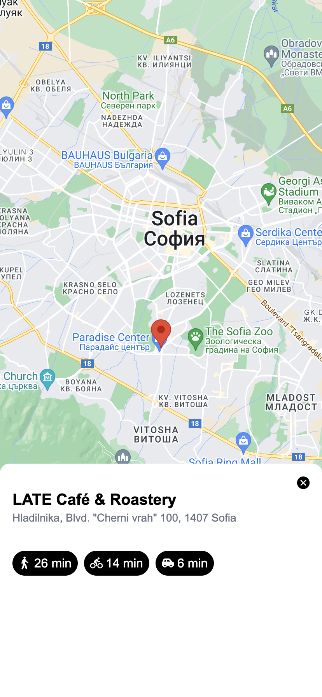

## NativeMap Example

This is an example of how to NativeMap component can be implement in a Lynx application.

This example includes a simple map with a marker and a button to change the marker position.

On the web, the map is rendered using the Google Maps API, and on iOS, it uses the native map.

For iOS there is a google map implementation as well, but it is not included in this example.
For google map you need key to use it.

## Screenshots

### Showing the current location
<table>
    <tr>
      <td>iOS</td>
      <td>Web</td>
    </tr>
    <tr>
        <td>
            
        </td>
        <td>
            
        </td>
    </tr>
</table>

### Map Pin example
<table>
    <tr>
      <td>iOS</td>
      <td>Web</td>
    </tr>
    <tr>
        <td>
            
        </td>
        <td>
            
        </td>
    </tr>
</table>

### Pin click example
<table>
    <tr>
      <td>iOS</td>
      <td>Web</td>
    </tr>
    <tr>
        <td>
            
        </td>
        <td>
            
        </td>
    </tr>
</table>

## Getting Started

First, install the dependencies:

```bash
npm install
```

for iOS, you need to install the pods:

```bash
cd ios && pod install
```

for web, you need to install the web dependencies:

```bash
cd web && npm install
```

Then, run the development server:

```bash
npm run dev
```

Scan the QRCode in the terminal with your LynxExplorer App to see the result.

You can start editing the page by modifying `src/App.tsx`. The page auto-updates as you edit the file.
